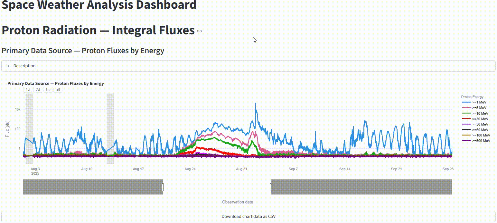

# Automatic Space Weather Data Retrieval, Processing and Visualization System
As it turns out it's going to be my **bachelor's thesis** ;)

### Example Chart


### Switching Space Weather Parameters


## Description
This repo contains code and thesis text for my bachelor's thesis(as the name indicates ;D). It's a system for a fully automatic retrieval, processing and vizualization of selected
parameters of space weather. As mentioned the flow is fully automated using GH Actions and code written in both Python and Go, which also happened to be contenerized for convenience ;D

## Starting the System

You can run the entire data collection and database saving pipeline locally using Docker Compose.

### Prerequisites
- Docker and Docker Compose installed
- Environment variables configured (see below)

### Setup

1. Create a `.env` file in the project root with the following variables:
   ```env
   DROPBOX_APP_KEY=your_dropbox_app_key
   DROPBOX_APP_SECRET=your_dropbox_app_secret
   DROPBOX_REFRESH_TOKEN=your_dropbox_refresh_token
   DB_HOST=your_database_host
   DB_USER=your_database_user
   DB_PASSWORD=your_database_password
   DB_NAME=your_database_name
   DB_PORT=your_database_port
   DATE=2026-01-22
   ```

2. **Important**: Add `.env` to your `.gitignore` to keep secrets safe.

### Running

To run the complete pipeline (data collection followed by database saving):

```bash
# Run with today's date
DATE=$(date +'%Y-%m-%d') docker-compose up
```

Or simply:

```bash
docker-compose up
```

The system will:
1. Build and run the `collect-data` service (retrieves space weather data and uploads to Dropbox)
2. Once complete, automatically run the `save-database` service (processes data and saves to database)

### Stopping

To stop and remove containers:

```bash
docker-compose down
```

## Possible future steps
- extending vizualization
- migrating vizualization module to another(faster) framework
- adding simple ML module 
- increasing data retrieval frequency

## Websites 

- [Dashboard](https://inzynierka-sskrzypczyk.streamlit.app/)
- [Thesis Online](https://szymonskrzypczyk.github.io/inzynierka/)

## Project structure
> - 📂 [`.github/workflows/`](.github/workflows/) - workflows working with GitHub Actions
> - 📂 [`dashboard/`](dashboard/) - all resources related to space weather visualization
> - 📂 [`db/`](db/) - all resources related to data saving to a database
> - 📂 [`docs/`](docs/) - static site resources for thesis hosting
> - 📂 [`documents/`](documents/) - all markdown documents, sketches, etc.
> - 📂 [`retrieval/`](retrieval/) - all resources related to data retrieval
> - 📄 [`requirements.txt`](requirements.txt) - root directory python requirements for **Streamlit**
> - 📄 [`detailed_guide.md`](detailed_guide.md) - project setup guide
> - 📄 [`mkdocs.yaml`](mkdocs.yaml) - page structure for online thesis

## [Setup guide](detailed_guide.md)