# Guide on setting up the system 

1. Fork the repository to your GitHub account
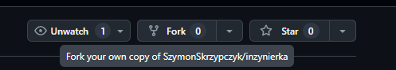
2. [Enable GH Actions in your fork](https://docs.github.com/en/repositories/managing-your-repositorys-settings-and-features/enabling-features-for-your-repository/managing-github-actions-settings-for-a-repository#managing-github-actions-permissions-for-your-repository)
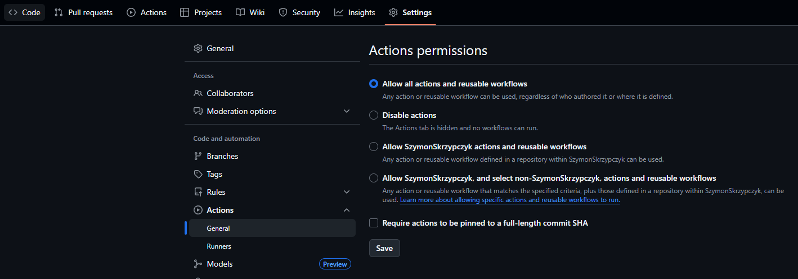
3. [Setup Dropbox app to get access token](https://www.dropbox.com/developers/apps)
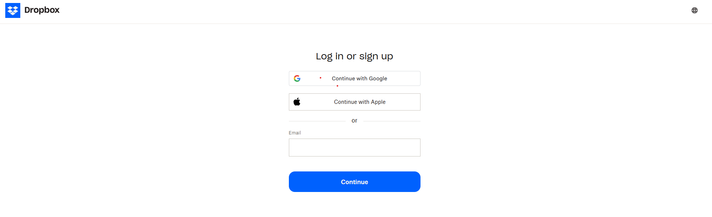
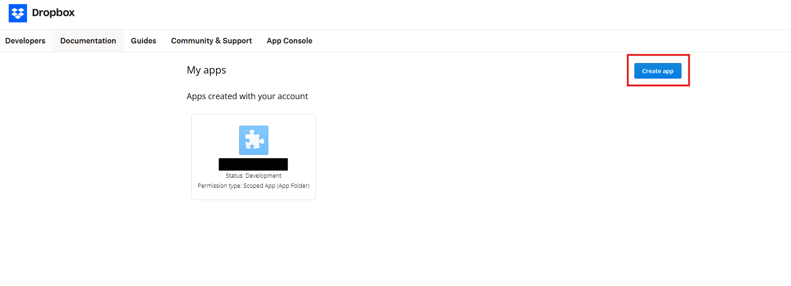
4. Using Dropbox app's `App key` and `App secret` [generate access token](https://dropbox.github.io/dropbox-api-v2-explorer/#oauth2-token-from-oauth2-authorize)

> Use [script](https://github.com/SzymonSkrzypczyk/inzynierka/blob/master/retrieval/get_refresh_token.py) to generate refresh token
5. Setup database, I used [Neon, because of its free tier](https://neon.com/) 
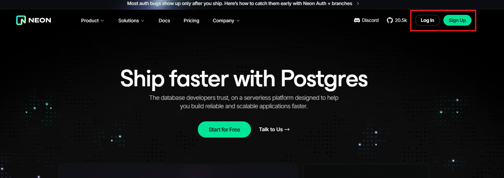
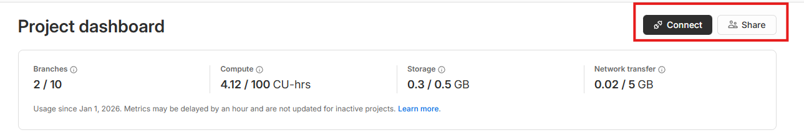
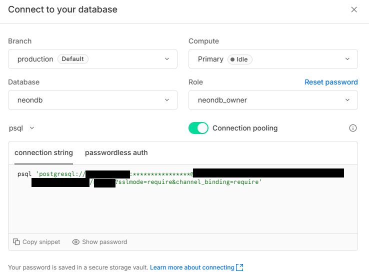
> Extract values needed for secrets from the connection string
> 
> Format: 'postgresql://**DB_USER**:**DB_PASSWORD**@**DB_HOST**/**DB_NAME**?sslmode=require&channel_binding=require'
6. Obtain gmail app password - https://support.google.com/accounts/answer/185833?hl=en - this is required to send email notifications, it will be needed to set up email notification
> follow this [link](https://myaccount.google.com/apppasswords)
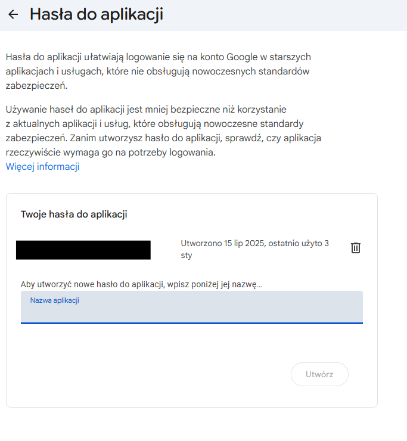
7. Set all necessary secrets in your repo settings - https://docs.github.com/en/actions/security-guides/encrypted-secrets 

**Required secrets:**
- `APP_NAME` - your application name
- `DB_HOST` - your database host 
- `DB_NAME` - your database name
- `DB_USER` - your database user
- `DB_PASSWORD` - your database password
- `DROPBOX_APP_KEY` - your Dropbox app key
- `DROPBOX_APP_SECRET` - your Dropbox app secret
- `DROPBOX_REFRESH_TOKEN` - your Dropbox refresh token
- `EMAIL_TO` - email to send notifications to
- `MAIL_CONNECTION` - your email connection string, format is `smtps://your@gmail.com:APP_PASSWORD@smtp.gmail.com:465`
8. Go to [Streamlit Cloud](https://streamlit.io/cloud) and login with GitHub by clicking on deploy for free
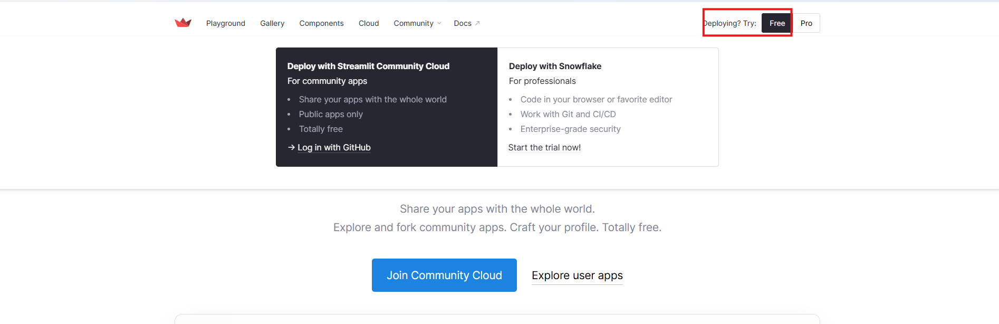
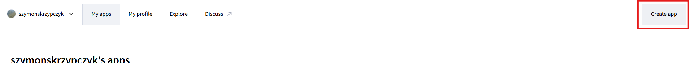
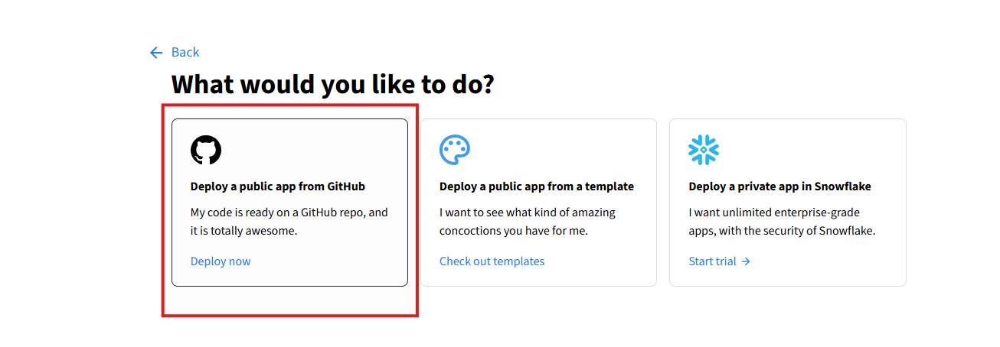
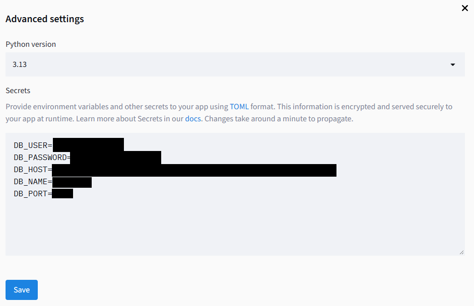
> The values for env variables for steps 7 and 8 should be the same!
