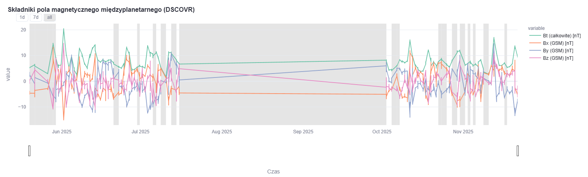
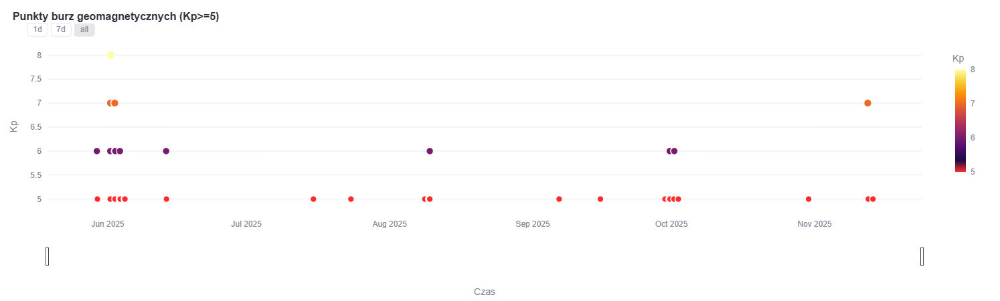

W tym rozdziale przedstawiono szczegółową analizę działania projektu, w tym omówienie  przykładowych wykresów zawierających rzeczywiste dane przetworzone przez system. W końcowej części rozdziału zaprezentowano również ograniczenia projektu oraz dokonano porównania z innymi istniejącymi systemami analizy pogody kosmicznej.

# 4. Analiza zaprojektowanego systemu

## 4.1 Charakterystyka zaimplementowanego systemu

W tym podrozdziale omówione zostaną cechy systemu zaimplementowanego w trzecim rozdziale i według założeń z drugiego rozdziału. Szczególny nacisk położono na umożliwienie niezawodnego przepływu danych oraz ich natychmiastową dostępność w module wizualizacji.

Opisywany system powstał w wyniku integracji poszczególnych modułów w trzy bloki, które dodatkowo współpracują ze sobą umożliwia szybki, w pełni opisany i klarowny proces przepływ danych. Dane pochodzące z zewnętrznego interfejsu programistycznego są przetwarzane codziennie niemal bez problemów, co świadczy o niezawodności projektu. Zgrupowanie wszystkich modułów poza modułem wizualizacji w połączone ze sobą przez potok danych bloki umożliwiło usprawnienie przepływu danych.

> Rys 4.1.1 Potok danych zaimplementowany przy pomocy Github Actions

Dzięki podzieleniu przetwarzania na trzy bloki funkcjonalności i zakres poszczególnych bloków pozwolił na zamknięte przetwarzanie, które nie wpływa na procesy poza zakresem danego bloku. Role bloków rozkładają się w następujący sposób:

- blok zbierania danych - odpowiada za pobranie i archiwizację danych
- blok zapisu danych do bazy danych - odpowiada za przygotowanie danych oraz ich zapis w bazie danych
- blok wizualizacji danych - odpowiada za przygotowanie interaktywnych wykresów

Dane po każdym z opisanych bloków znajdują się w chmurze umożliwiając stały dostęp i ich przetwarzanie. Dodatkowo, zapobiega to sytuacji, w której jeden z etapów systemu próbuje uzyskać dane, które nie są aktualnie dostępne. Ponieważ każdy etap przetwarzania ma zaimplementowaną obsługę błędów potencjalne błędy nie powodują natychmiastowego zatrzymania całego systemu, a jedynie podjęcie ponownej próby przeprowadzenia danej operacji.

System jest w całości zautomatyzowany, dzięki użyciu technologii chmurowych. Ich wysoka dostępność i odseparowanie warstwy przetwarzania systemu od kodu, umożliwiają nieprzerwane przetwarzanie z ustaloną częstotliwością. Zastosowanie Github Actions jako głównego narzędzia do stworzenia potoku danych, umożliwiło odseparowanie odpowiedzialności za przepływ danych od użytkownika oraz umożliwiło codzienne przetwarzanie danych o tej samej porze wzmacniając jednolitość danych.

W wyniku optymalizacji procesów zastosowanych w potoku danych przetwarzanie danych trwa nie więcej niż 4 minuty nawet w przypadku ponawiania operacji w wyniku błędów. Zapisywane archiwa mają rozmiar około 500 KB dla każdego dziennego pomiaru, umożliwiając ich efektywne przechowywanie oraz szybki dostęp do danych historycznych.

Każdy etap przetwarzania jest wyposażony w mechanizmy logowania i monitorowania umożliwiając szybkie i sprawne wykrywanie i analizowanie błędów potencjalnie występujących w projekcie oraz umożliwia obserwowanie przepływu danych przez system.

Zastosowanie bez serwerowej bazy danych w systemie umożliwiło ciągły dostęp do zapisanych danych oraz wymusiło przechowywanie tabel wymaganych w dalszej analizie, bez nadmiarowych szczegółów.

Moduł wizualizacji umożliwia interaktywną analizę danych, w tym filtrowanie ze względu na analizowane zmienne, wybieranie określonych okien czasowych, a nawet zapisywanie wykresów do plików w formacie PNG.

Podsumowując, zaimplementowany system zapewnia niezawodny i szybki przepływ danych, umożliwia ich stały dostęp, monitorowanie procesów oraz interaktywną analizę. Dzięki modularnej strukturze system może być w przyszłości rozszerzany poprzez dodawanie nowych modułów, na przykład poprzez dodanie dodatkowych modułów przetwarzania danych lub rozszerzonych funkcji wizualizacyjnych,

## 4.2 Przykłady analizy rzeczywistych danych

W tym podrozdziale przedstawiono przykłady analizy danych rzeczywistych uzyskanych przy użyciu zaimplementowanego systemu. Celem jest zaprezentowanie możliwości systemu w zakresie wizualizacji danych dotyczących zjawisk pogody kosmicznej.

### 4.2.1 Analiza składników pola magnetycznego międzyplanetarnego

> Rys 4.2.1 Figura przedstawiająca rozkład wartości składników pola magnetycznego międzyplanetarnego w czasie

Na wykresie przedstawionym na rysunku 4.2.1 zaprezentowana poszczególne składowe wartości pola magnetycznego międzyplanetarnego, barwy pomarańczowa, niebieska i różowa oznaczają kolejno składowe X, Y i Z opisywanego pola, a barwą zieloną opisane zostało całkowite pole magnetyczne międzyplanetarne. W celu analizy pojedynczych składowych możliwe jest ich wyłączenie poprzez kliknięcie w odpowiednią pozycję w legendzie figury. 

W celu uzyskania szczegółowych wartości dla danego dnia należy najechać kursorem na odpowiedni dzień co spowoduje pokazanie podpisu wraz z wartościami zarejestrowanymi danego dnia.

Dodatkowo, okresy braku danych zostały zaznaczone na szaro, co pozwala na ich oddzielenie od danych dostępnych do analizy. Dzięki temu można zaobserwować na przykład awarie satelity DSCOVR. Jedną z awarii widać wyraźnie na środku wykresu, rozpoczęła się ona 15 lipca i trwała aż do początku października, w tym czasie satelita nie przesyłała danych odnośnie składników pola magnetycznego międzyplanetarnego. Według raportu NOAA awaria była spowodowana anomalią w oprogramowaniu i spowodowała reset procesora satelity([NOAA, 2025](https://www.ospo.noaa.gov/data/messages/2025/07/MSG_20250715_1910.html)).

### 4.2.2 Analiza wartości indeksu Kp

> Rys 4.2.2 Figura przedstawiająca wartości planetarnego indeksu Kp w czasie

Na wykresie przedstawionym na rysunku 4.2.2 zaprezentowano wartości indeksu Kp, opisującego intensywność burzy geomagnetycznej, w kolejnych dniach. Wykres umożliwia analizę występowania burz geomagnetycznych o różnej skali.

W celu uzyskania szczegółowych wartości dla danego dnia należy najechać kursorem na odpowiedni dzień, co spowoduje wyświetlenie podpisu wraz z wartościami indeksu zarejestrowanymi danego dnia. Na wykresie widać jeden punkt z wartością 8 indeksu Kp, oznaczający poważną burzę geomagnetyczną, do której doszło 1 czerwca 2025 roku.

Dodatkowo, również na tym wykresie braki danych zostały zaznaczone kolorem szarym w celu odróżnienia ich od danych możliwych do analizy.

>Rys 4.2.3 Figura przedstawiająca burze geomagnetyczne w czasie

Dopełnieniem poprzedniego wykresu jest wykres przedstawiony na rysunku 4.2.3, który obrazuje wartości indeksu Kp, które zostały zakwalifikowane jako burze geomagnetyczne według skali podanej we wstępie pracy. Wykres umożliwia szybką klasyfikację dni z intensywnymi zjawiskami oraz ich wizualne zestawienie.

## 4.3 Ograniczenia projektu 

Zaprojektowany system posiada pewne ograniczenia wynikające zarówno z przyjętej architektury, jak i charakterystyki zastosowanych źródeł danych. Ograniczenia te wpływają na projekt w takich obszarach, jak dostępność danych, ilość przetworzonych danych, czy zakres przeprowadzonej analizy. Świadomość tych ograniczeń pozwala na poprawną interpretację wyników oraz wskazuje na potencjalne kierunki rozwoju. 

Poniżej omówiono główne ograniczenia systemu w kontekście danych, funkcjonalności oraz jego zastosowania.

### 4.3.1 Ograniczenia związane z danymi

Dane wykorzystywane przez system pochodzą z jednego źródła danych,  co naraża go na potencjalne braki danych spowodowane awarią interfejsu programistycznego SWPC. Wystąpienie problemów w module źródła danych może prowadzić do nieciągłości w danych, a w rezultacie do ograniczenia możliwości analitycznych systemu.

Dodatkowym celowym ograniczeniem jest pobieranie danych raz dziennie o tej samej porze. Rozwiązanie to zapewnia spójność danych i umożliwia przeprowadzanie porównywalnych analiz między poszczególnymi dniami. Jednocześnie prowadzi do zawężenia zakresu danych dostępnych dla systemu, potencjalnego powodując pomijanie istotnych dla danych zjawisk danych.

### 4.3.2 Ograniczenia techniczne

System posiada również ograniczenia techniczne, które wpływają na sposób jego działania oraz zakres dostępnych funkcjonalności. Ich źródłem są przede wszystkim zastosowane narzędzia oraz infrastruktura, w szczególności baza danych.

Najpoważniejszym ograniczeniem w tym obszarze jest limit przepływu danych narzucony przez dostawcę bazy danych, wynikający z użycia darmowego planu usługowego. Wymusiło to zastosowanie ograniczenie ilości wykorzystywanych tabel, w celu nie przekroczenia dozwolonego limitu. Pomimo mniejszego znaczenia usuniętych tabel dla analizy zjawisk pogody kosmicznej, wraz z ich utratą ograniczono  w pewnym stopniu analizę zjawisk o mniejszym priorytecie.

W rezultacie system działa poprawnie w ramach przyjętych założeń, jednak pełniejsza analiza byłaby możliwa po rozszerzeniu zasobów np. poprzez użycie płatnego planu usługowego.

### 4.3.3 Ograniczenia projektowe

Ograniczenia projektowe wynikają z podjętych na etapie planowania decyzji projektowych oraz sposobu ich realizacji. Ograniczenia te zostały świadomie przyjęte, aby zapewnić spójność architektury i implementacji projektu w ramach pracy inżynierskiej.

Pierwszym istotnym ograniczeniem projektowym było zawężenie funkcjonalności systemu do wybranych zjawisk pogody kosmicznej. Projekt nie obejmuje wszystkich dostępnych metryk i informacji, a jedynie te uznane za najbardziej istotnych dla przyjętych celów projektu oraz efektywnego przeprowadzanie analizy.

Kolejnym ograniczeniem jest rezygnacja z implementacji metod opartych na uczeniu maszynowym. Choć ogranicza to możliwości przeprowadzenie zaawansowanych analiz predykcyjnych, system nadal umożliwia rzetelną i efektywną analizę danych poprzez dostępne interaktywne metody wizualizacyjne.

W rezultacie system realizuje wszystkie przyjęte cele projektowe, jednocześnie wskazując potencjalne obszary rozwoju projektu o nowe funkcjonalności.

## 4.4 Porównanie z istniejącymi rozwiązaniami

https://www.swpc.noaa.gov/communities/space-weather-enthusiasts-dashboard

https://www.spaceweatherlive.com/